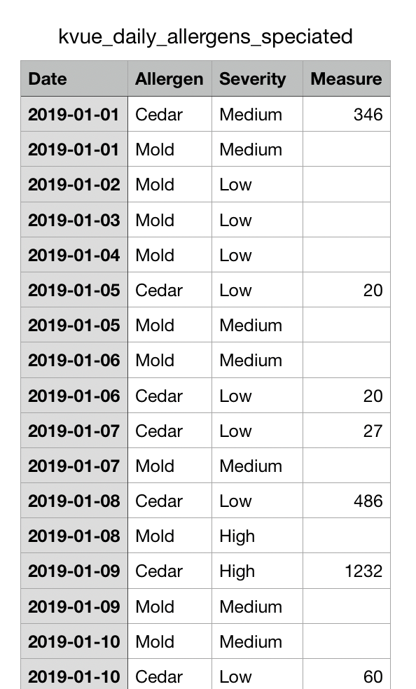
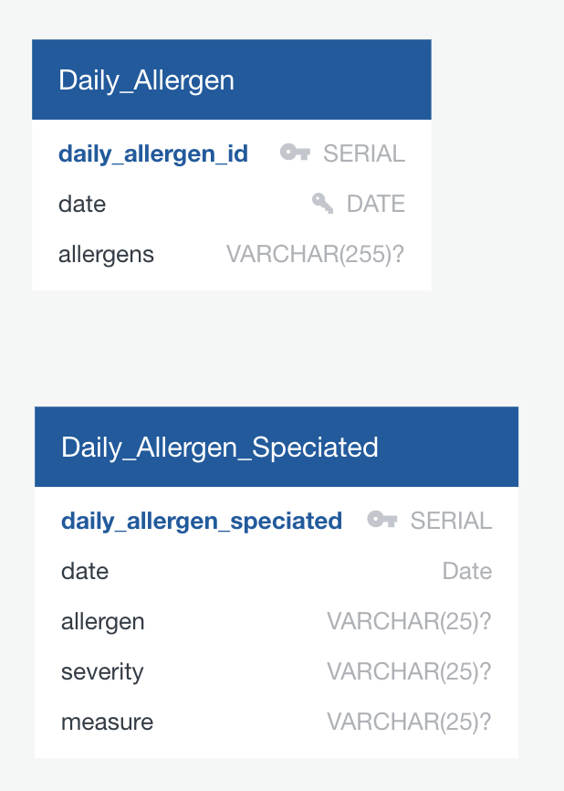

# ETL Project Plan: A-Choose Your Best Weather
## Team : Alli Vaughn, Amy Koldeway, Sarah Cross

# Proposal

## Extraction: What are your data sources for extraction? 

### Web Scraped Data: 
* [KVUE Allergy Calendar](https://kvue.com/allergy)

### API Pull 
* [OpenWeatherAPI](https://openweathermap.org/api)

## Transformation:  What Transformations? 
### KVUE:
* Save Monthly Allergy Calendar data as PDFs 
* Save each calendar as HTML
* Read each HTML file to get date and allergens
* Transformed & cleaned in Pandas
    * Second dataframe of each allergen found by day created
* Output to csv

### Open Weather Data: 
* Pull csv ATX data for 2019 
* dates 
* temps
* pressure
* humidity
* wind speed
* others as necessary
* Transformed & cleaned in Pandas
* output to csv

## Load: How and where will you load the data?  
### PostgreSQL: 
* weather data - three tables with a foreign key and a join  
* allergens - two tables

# Project Reality : 

# Extract & Transform 

## KVUE Scraping Process
* Each monthly allergen calendar was manually exported to PDF and then saved as HTML

* For each file, we then used Beautiful Soup to scrap the data.
    * Pull Month and Year from the page
    * Each calendar is a table with (generally) each td tag representing a day
    * Loop through reach td tag and establish if this a day for the month be looking for appropriate data
    * If established is a day for the month, then add day to dictionary with allergens (if any)
* Load dictionary into pandas dataframe
* Clean allergen data and create a DATE column for Month, Day and Year values.  Export to CSV.

Raw Data Frame

Cleaned, Formatted CSV

With that information in hand, we wanted to parse the allergen data.  Some days have multiple values (separated by commas) and then each allergen generally had a severity (High, Medium, Low) and some had a measurement in gr/m3. 
* Loop through each day and parse the allergen data with a function to parse our individual allergens. Create new dataframe for each allergen found.
* Export parsed allergen data to CSV

Parsed Allergen CSV

## Weather Scraping Process

* 7 years of weather data for the city of Austin was downloaded from Open Weather Map as a csv file, rather than the planned API pull, as we could only get the  current weather for free that way.  

* Weather ID codes and standard units for the csv files were also scrapped with Pandas from Open Weather Map site

    
    * Weather Data was transformed by:
        * Dropped columns not being used
        * Renamed columns to include units
        * Added in City and Lat/Long info for every row and this was not included in the csv file.
        * Calculated temps, pressure and precipitation in imperial units
        * Reformatted date from UTC to YYYY-MM-DD format
        * exported to csv
        
    
    * Weather ID data was transformed by: 
        * Reading all tables on the page
        * Checking for consistent headers
        * Renaming headers so all tables can be concatenated for cross referencing
        * exported to csv

        
    * Units data was transformed by:
     	* being read via Pandas to a table
     	* reference table only

    

# Load

## Where is data going to be loaded
* Load to pgAdmin postgres database because the dataset is long and narrow and sql db are better for this shape.
* Data can also be joined on date between datasets and foreign keys; therefore, a relational database will work best for our data.

   

   

## Potential Queries
* Find the median weather ID per day and relate to weather_id key from Weather ID table.
* Find the avg temp, pressure, precipitation values for each day from the Weather Table  (24 hours total) (weather table data comes in 1 hr increments).
* Join munged data from weather table (avg values) and allergen table on date.
* Query results based on specific allergen or level assignment (low, medium, high).
* See if there's any correlation between allergens and weather/weather events.
* With more daily allergen info, could identify allergen trends year over year.

<<<<<<< HEAD
## KVUE Scraping Process
* Each monthly allergen calendar was exported to PDF and then saved as HTML
* For each file, we then used Beautiful Soup to scrap the data.
    * Pull Month and Year from the page
    * Each calendar is a table with (generally) each td tag reprsenting a day
    * Loop through reach td tag and establish if this a day for the month be looking for appropriate data
    * If established is a day for the month, then add day to dictionary with allergens (if any)
* Once each file had been scraped, we saved the list of dictionary as a .csv file for data processing in pandas
=======
## Data Cleaning Issues
* Allergen data was provided in a non-uniform format from the original data source.
* Dates, descriptions and values were not located at the same level of tables in the HTML files.
* Some allergen data had descriptions only and no values and vice versa. 
Parsing the data into common formats was difficult due to all of the exception cases.
>>>>>>> e21e17a873041fc7f9cc3b215d8bfedc40333b34

## Weather Scraping Process
* 7 years of weather data for the city of Austin was downloaded from Open Weather Map as a csv file.
* Weather ID codes and standard untis for the csv files were also scrapped with Pandas from Open Weather Map site
    * Weather Data was transformed by:
        * Dropped columns not being used
        * Renamed columns to include units
        * Added in City and Lat/Long info for every row and this was not included in the scv file.
        * Calculated temps, pressure and precipitation in imperial units
        * Reformatted date from UTC to YYYY-MM-DD format
    * Weather ID data was transformed by: 
        * Reading all tables on the page
        * Checking ofr consitent headers
        * Renaming headers so all tables can be concatinate together for cross referenceing
    * Units data was read via Pandas to a table for reference only, not intended for futher data transformation.

## Where is data going to be loaded
* Load to pgAdmin postgres database because the dataset is long and narrow and sql db are better for this shape.
* Data can also be joined on date between datasets and foreign keys; therefore, a relational database will work best for our data.

## Queries
* Find the median weather ID per day and relate to weather_id key from Weather ID table.
* Find the avg temp, pressure, precipitation values for each day from the Weather Table  (24 hours total) (weather table data comes in 1 hr increments).
* Join munged data from weather table (avg values) and allergen table on date.
* Query results based on specific allergen or level assignment (low, medium, high).

## Data Cleaning Issues
* Allergen data was provided in a non-uniform format from the original data source.
Dates, descriptions and values were not located at the same level of tables in the HTML files.
Some allergen data had descriptions only and no values and vice versa. 
Parsing the data into common formats was difficult due to all of the exception cases.

